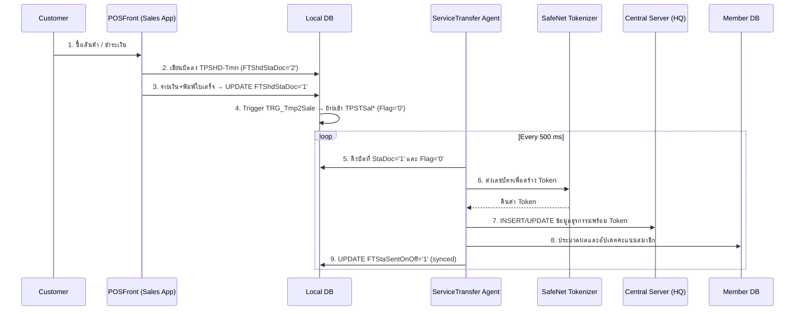

# ServiceTransfer: Software Requirements Specification & Architecture

> 🔗 **Interactive diagrams:** open the live, theme-aware versions in [`Diagrams/00_Index.html`](../doc-claude-ver/Diagrams/00_Index.html) — e.g. the clickable [System Architecture graph](../doc-claude-ver/Diagrams/02_System_Architecture.html) and the new [End-to-End Transaction Lifecycle](../doc-claude-ver/Diagrams/06_Transaction_Lifecycle.html) (POSFront → ServiceTransfer). The Mermaid diagrams below render natively on GitHub / GitLab / VS Code.

## 1. Executive Summary
Each branch POS terminal runs **two cooperating VB6 programs**. They never call each other directly — they hand off through the **Local DB** using two status flags, which makes the terminal fully **offline-capable**.

- **POSFront** *(the producer)* — the cashier-facing sales application (Adasoft, "TAKASHIMAYA project", v6.2412.1). It reads master data from the server, records each sale into the local database, takes payment, prints the receipt, and marks the bill complete (`FTShdStaDoc = '1'`). Its `Sub Main` is also the launcher that starts the four background services, **including ServiceTransfer itself**.
- **ServiceTransfer** *(the consumer)* — a background data-synchronization agent running on a 500ms timer loop. Its primary duties are:
  1. **Sales Synchronization:** Transfers completed sales (header, detail, receipt, card, deposit, hold, voucher, and points) flagged with `FTStaSentOnOff = '0'` from the local SQL Server Express database to the central SQL Server at the Head Office.
  2. **Data Tokenization:** Tokenizes sensitive card data through the SafeNet SOAP web service before any sensitive value leaves the branch.
  3. **Member Points:** Posts accumulated member points to a separate Member database (`TCNMMallCard` / `TPSTBPHis`).

While resilient (handling duplicate updates, timeouts, and ensuring header records are only sent after child tables), the design carries significant legacy risks: VB6 is EOL, SQL statements are dynamically concatenated (SQL Injection risk), lack of DB transactions, plain-text credentials, and inefficient 500ms polling. This document outlines the legacy behavior and the targeted revamp architecture.

---

## 2. Business Context & Stakeholders

### 2.1 Stakeholders
| ผู้มีส่วนได้ส่วนเสีย (Stakeholder) | ความคาดหวัง (Expectation) |
| --- | --- |
| **Branch Operations (สาขา)** | POS ทำงาน offline ได้ และ auto-sync ข้อมูลทันทีเมื่อเชื่อมต่อกลับ |
| **HQ Management (สำนักงานใหญ่)** | ข้อมูลยอดขายรวมศูนย์แบบใกล้เคียง Real-time สำหรับ Reporting & Analytics |
| **Members / Customers (สมาชิก)** | คะแนนสะสมได้รับการอัปเดตและพร้อมใช้งานได้โดยเร็ว |
| **Compliance (PCI-DSS)** | ข้อมูลบัตรเครดิต/สมาชิกต้องถูก Tokenize เสมอก่อนส่งออกจากสาขา |
| **IT Operations** | Auto-recovery เมื่อเกิดข้อผิดพลาด, Logging ชัดเจน, ลด manual intervention |

### 2.2 End-to-End Business Flow


---

## 3. End-to-End Transaction Lifecycle (POSFront → ServiceTransfer)

โปรแกรมสองตัวบนเครื่อง POS ทำงานแบบ **Producer / Consumer** ส่งต่องานกันผ่าน Local DB ด้วย **ธงสถานะ 2 ตัว**

### 3.1 Orchestration — POSFront เป็นผู้เปิดบริการเบื้องหลัง
`POSFront.Sub Main` (`mDB.bas`) เปิดบริการ 4 ตัวตามลำดับ: **ServiceOnOff.exe** (สถานะ Online/Offline), **ServiceAutoReplicate.exe** (Replicate Master จาก Server ลง Local), **ServiceAutoClear.exe** (เคลียร์ไฟล์), และ **ServiceTranfer.exe** (= ServiceTransfer) ดังนั้น ServiceTransfer เป็น Child process ของ POSFront ไม่ใช่โปรแกรมเดี่ยว

### 3.2 The Two-Flag Handshake

| Flag | Owner | Meaning | Trigger event |
| --- | --- | --- | --- |
| `FTShdStaDoc` | **POSFront** | `'2'` กำลังทำ → `'1'` เสร็จสมบูรณ์ | จ่ายเงิน + พิมพ์ใบเสร็จ |
| `FTStaSentOnOff` | **ServiceTransfer** | `'0'` รอส่ง → `'1'` ส่งขึ้น HQ แล้ว | INSERT/UPDATE Central DB สำเร็จ |

เมื่อ `FTShdStaDoc` ถูก UPDATE `'2'`→`'1'` บน `TPSHD<Tmn>` → **SQL Trigger `TRG_Tmp2Sale<Tmn>`** (`AFTER UPDATE`) เรียก `STP_PRCxTmp2Sale` ย้ายบิลเข้า `TPSTSalHD/DT/RC/CD` (ตั้ง `FTStaSentOnOff='0'`) แล้ว ServiceTransfer จึงรับช่วงต่อ

---

## 4. System Architecture (Legacy)

### 4.1 Legacy Component Architecture
สถาปัตยกรรมเดิมใช้การรันโปรแกรม Background บนเครื่อง POS โดยเชื่อมต่อฐานข้อมูลโดยตรงผ่าน ADODB OLEDB Provider ຂ้ามระบบเครือข่าย

```mermaid
flowchart TD
    subgraph POS Terminal (Branch)
        POS_App[POSFront\nSales App VB6]
        LocalDB[(Local DB\nSQL Express)]
        Trg{{TRG_Tmp2Sale\nSTP_PRCxTmp2Sale}}
        ST[ServiceTransfer.exe\n VB6 Agent 500ms]
        Config[AdaIni.Ada\n Access DB Config]

        POS_App -->|write bill StaDoc 2 to 1| LocalDB
        LocalDB --> Trg
        Trg -->|promote to TPSTSal Flag 0| LocalDB
        Config -.->|read password| ST
        LocalDB <-->|SELECT Flag 0 / UPDATE Flag 1| ST
    end

    subgraph Head Office (HQ)
        CentralDB[(Central Server\nOnline DB + Master)]
        MemberDB[(Member DB)]
    end

    subgraph Security Layer
        SafeNet[SafeNet Tokenizer\nSOAP Web Service]
    end

    CentralDB == "replicate master\n(ServiceAutoReplicate)" ==> POS_App
    ST == "INSERT/UPDATE\n(SQLOLEDB.1)" ==> CentralDB
    ST == "UPDATE Points" ==> MemberDB
    ST <-->|"Tokenize (FIRST_SIX)"| SafeNet
```

### 4.2 Key Features & Constraints
- **Automated Background Sync:** ทำงานด้วย Timer Polling ทุก 500 ms ซึ่งกินทรัพยากร CPU/IO สูงเกินความจำเป็น
- **Resilient Offline Support:** ระบบรองรับ Offline Mode เต็มรูปแบบโดยอาศัย Flag `FTStaSentOnOff` 
- **Dynamic SQL Generation:** โค้ดใช้วิธีการต่อ String (Concatenation) เพื่อสร้าง SQL Query ซึ่งเป็นจุดอ่อนด้าน Security
- **Multi-Table Sync:** ซิงค์ตารางเรียงลำดับตามคอนฟิก `TSysSync` โดยยึดหลัก HD-First Rule (ตรวจสอบว่าตารางลูกต้องส่งครบก่อนส่ง Header)
- **Tokenization:** ห้ามส่งเลขบัตรจริงออกจากสาขาโดยเด็ดขาด

---

## 5. Revamp Recommendations (Target Architecture)

การปรับปรุงระบบ (Revamp) ไม่ควรเป็นการแปลงโค้ดจาก VB6 เป็นภาษาใหม่โดยตรง แต่ควรปรับแก้ปัญหาในเชิงสถาปัตยกรรม (Architectural Shift) ให้เป็นระบบที่มีความปลอดภัย ลดภาระระบบ และขยายขนาด (Scale) ได้ง่ายขึ้น

### 5.1 Recommended Target Architecture
แทนที่การเปิด Connection ฐานข้อมูลข้าม WAN ด้วยการใช้สถาปัตยกรรมแบบ **Event-Driven** และ **API Gateway**

```mermaid
flowchart TD
    subgraph POS Terminal (Branch)
        LocalDB[(Local DB)]
        NewAgent[New Go/.NET Agent\n(Event-Driven)]
        LocalDB -->|Tail Logs / Event| NewAgent
    end

    subgraph Message Broker
        MQ[RabbitMQ / Kafka]
    end

    subgraph HQ Microservices
        APIGW[API Gateway\n(REST/gRPC)]
        SyncSvc[Sync Service]
        PointSvc[Member Point Service]
    end

    subgraph Databases & Security
        CentralDB[(Central DB)]
        MemberDB[(Member DB)]
        TokenSvc[Modern Token Service\nHSM / Cloud KMS]
    end

    NewAgent -- "Publish Events\n(TLS Encrypted)" --> MQ
    MQ -- "Consume" --> APIGW
    APIGW --> SyncSvc
    APIGW --> PointSvc
    
    SyncSvc <--> TokenSvc
    SyncSvc --> CentralDB
    PointSvc <--> TokenSvc
    PointSvc --> MemberDB
```

### 5.2 Prioritized Improvement List
1. **CRITICAL - Event-Driven Architecture:** เปลี่ยนจาก Timer Polling (500ms) เป็นการดักจับ Event เมื่อมีบิลใหม่ (เช่น File System Watcher หรือ CDC จาก Local DB) ส่งเข้า Message Queue
2. **CRITICAL - API Gateway & Transactions:** ห้ามต่อ DB ข้ามเครือข่าย ให้ยิงข้อมูลเข้า API ที่ฝั่ง HQ แทน เพื่อให้ API เป็นคนควบคุม Database Transaction (BEGIN TRAN...COMMIT) ป้องกันข้อมูลขาดหาย
3. **CRITICAL - Parameterized Queries:** เลิกวิธีการต่อ String (Concatenation) เพื่อสร้าง SQL และใช้ ORM หรือ Parameterized SQL อย่างเคร่งครัด
4. **HIGH - Connection Encryption & Secrets:** บังคับใช้ TLS/SSL ระหว่างสาขาและสำนักงานใหญ่ และย้าย Credentials ไปไว้ใน Secure Vault (แทน MS Access DB)
5. **MEDIUM - Observability:** เพิ่ม Structured Logging (เช่น JSON Logs) และ Health Check ให้ตรวจสอบสถานะ Agent ของทุกสาขาจากศูนย์กลางได้
