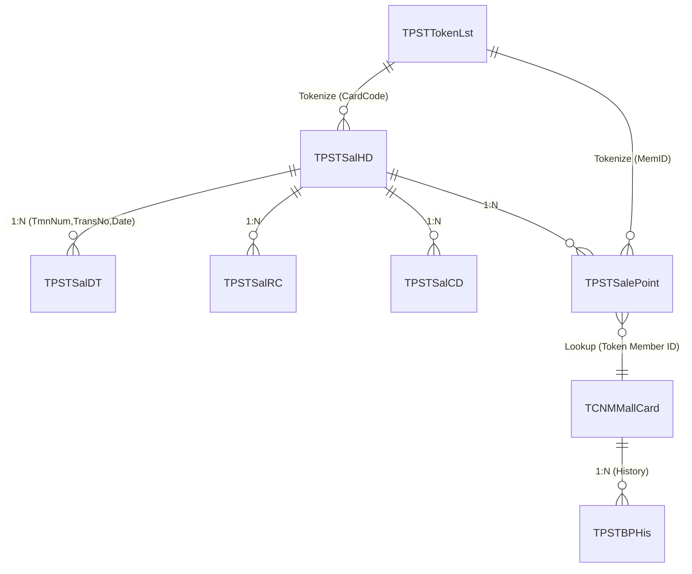

# ServiceTransfer: Data Dictionary

เอกสารฉบับนี้รวบรวมโครงสร้างข้อมูลที่โปรแกรม ServiceTransfer เขียนและอ่าน เพื่อใช้เป็นแบบอ้างอิง (Schema Reference) สำหรับการพัฒนาใหม่

## 1. Naming Convention (กฎการตั้งชื่อฟิลด์)
ระบบเดิมใช้ **Hungarian Notation** โดยตัวอักษร 2 ตัวแรก (Prefix) จะเป็นตัวกำหนดประเภทข้อมูลในโค้ด (Dynamic SQL Generator ใช้ Prefix นี้เพื่อพิจารณาใส่เครื่องหมาย Quote หรือ Format วันที่)

| Prefix | ประเภท (Type) | SQL Type | ตัวอย่าง (Examples) |
| --- | --- | --- | --- |
| **FT** | Text (String) | VARCHAR | FTTmnNum, FTShdTransNo |
| **FD** | Date | DATE / DATETIME | FDShdTransDate, FDMcdExpDate |
| **FC** | Currency / Count | NUMERIC / DECIMAL | FCSpoPoint, FCBalance |
| **FN** | Number (Integer)| NUMERIC / INT | FNSdtSeqNo, FNStatus |

---

## 2. Entity Relationship Diagram (ERD)

---

## 3. กลุ่มตารางธุรกรรมการขาย (Sales Transaction Tables)

ทุกตารางในกลุ่มนี้จะมี Primary Key 3 ตัวแรกร่วมกัน (Composite Key) คือ `FTTmnNum` (รหัสเครื่องจุดขาย), `FTShdTransNo` (เลขที่บิล), `FDShdTransDate` (วันที่ทำรายการ) และมี `FTStaSentOnOff` เป็นสถานะการซิงค์: `0`=Pending, `1`=Synced, `3`=Needs Update

### 3.1 TPSTSalHD — ส่วนหัวธุรกรรมการขาย (Sales Header)
| # | คอลัมน์ (Column) | ประเภท | Key | คำอธิบาย (Description) |
|---|---|---|---|---|
| 1 | FTTmnNum | VARCHAR | PK | รหัสเครื่องจุดขาย (Terminal Number) |
| 2 | FTShdTransNo | VARCHAR | PK | เลขที่ธุรกรรม (Running Number ต่อวัน) |
| 3 | FDShdTransDate | DATE | PK | วันที่ทำรายการ (Format YYYY/MM/DD) |
| 4 | FTShdTransType | VARCHAR | | ประเภทธุรกรรม (ดูตารางรหัส) |
| 5 | FTShdStaDoc | VARCHAR | | สถานะเอกสาร — '1' = เสร็จสมบูรณ์ |
| 6 | FTStaSentOnOff | VARCHAR | | สถานะการซิงค์ — 0 = รอ, 1 = ส่งแล้ว, 3 = ต้อง Update |
| 7 | FTCstCardCode | VARCHAR | **TKN** | รหัสบัตรลูกค้า — **ถูก Tokenize ก่อนส่งขึ้น Server** |
| 8 | FTSendUp | VARCHAR | | สถานะส่งขึ้น — ถูก Force เป็น '0' เมื่อ INSERT ขึ้น Server |

### 3.2 TPSTSalDT — รายละเอียดธุรกรรมการขาย (Sales Detail)
| # | คอลัมน์ (Column) | ประเภท | Key | คำอธิบาย (Description) |
|---|---|---|---|---|
| 1-3 | TmnNum / TransNo / Date | VARCHAR/DATE | PK, FK | อ้างอิง TPSTSalHD |
| 4 | FNSdtSeqNo | NUMERIC | PK | ลำดับรายการสินค้า (Line Number) |
| 5 | FTStaSentOnOff | VARCHAR | | สถานะการซิงค์ |

### 3.3 TPSTSalRC — การรับชำระเงิน (Sales Receipt)
| # | คอลัมน์ (Column) | ประเภท | Key | คำอธิบาย (Description) |
|---|---|---|---|---|
| 1-3 | TmnNum / TransNo / Date | VARCHAR/DATE | PK, FK | อ้างอิง TPSTSalHD |
| 4 | FNSrcSeqNo | NUMERIC | PK | ลำดับการรับชำระ |
| 5 | FTTdmCode | VARCHAR | | รหัสประเภทการชำระ (Tender Code) |
| 6 | FTSrcCardNo | VARCHAR | **TKN** | หมายเลขบัตร — **Tokenize เมื่อ FTTdmCode = T002 / T003 / T017** |

### 3.4 TPSTSalCD — ข้อมูลบัตรส่วนลด (Sales Card)
| # | คอลัมน์ (Column) | ประเภท | Key | คำอธิบาย (Description) |
|---|---|---|---|---|
| 1-3 | TmnNum / TransNo / Date | VARCHAR/DATE | PK, FK | อ้างอิง TPSTSalHD |
| 4 | FNSdtSeqNo | NUMERIC | PK, FK | อ้างอิง TPSTSalDT |
| 5 | FNScdSeqNo | NUMERIC | PK | ลำดับบัตรในรายการ |
| 6 | FTScdCardID | VARCHAR | **TKN** | รหัสบัตร — **Tokenize เมื่อ FNDctNo = 11, 12, 15, 28** |
| 7 | FNDctNo | NUMERIC | | ประเภทส่วนลด (Discount Type) |

### 3.5 TPSTSalePoint — คะแนนสะสมต่อธุรกรรม
| # | คอลัมน์ (Column) | ประเภท | Key | คำอธิบาย (Description) |
|---|---|---|---|---|
| 1-3 | TmnNum / TransNo / Date | VARCHAR/DATE | PK, FK | อ้างอิง TPSTSalHD |
| 4 | FTSpoMemID | VARCHAR | PK, **TKN** | รหัสสมาชิก — **Tokenize ก่อนส่งขึ้น Server** |
| 5 | FCSpoPoint | NUMERIC | | คะแนนที่ได้รับ (บวก/ลบตาม TransType) |
| 6 | FTRemark | VARCHAR | | สถานะประมวลผลคะแนน — 0 = รอ, 1 = ส่งเข้า Member DB แล้ว |
| 7 | FDDateUpd | DATE | | เก็บ ExpDate ของบัตรที่ได้มาจาก Member DB |

---

## 4. กลุ่มตารางสมาชิก (Member & Points Tables)

### 4.1 TCNMMallCard — ข้อมูลบัตรสมาชิก (Member Master)
| # | คอลัมน์ (Column) | ประเภท | Key | คำอธิบาย (Description) |
|---|---|---|---|---|
| 1 | FTMcdCode | VARCHAR | PK | รหัสบัตรสมาชิก (เก็บเป็นค่า Token เสมอ) |
| 2 | FDMcdExpDate | DATE | PK | วันหมดอายุบัตร |
| 3 | FTMcdStaAct | VARCHAR | | สถานะ Active — 'A' = ใช้งาน |
| 4 | FCMcdAmountPoint | NUMERIC | | คะแนนจากยอดซื้อ |
| 5 | FCMcdTotalPoint | NUMERIC | | คะแนนรวมยกมา |
| 6 | FCEarned | NUMERIC | | คะแนนสะสมที่ได้รับเพิ่ม (+/-) |
| 7 | FCBalance | NUMERIC | | คะแนนคงเหลือ (TotalPoint + Earned) |

### 4.2 TPSTBPHis — ประวัติคะแนนสะสม (Bonus Point History)
| # | คอลัมน์ (Column) | ประเภท | Key | คำอธิบาย (Description) |
|---|---|---|---|---|
| 1-4 | TmnNum/TransNo/Date/MemberID | VARCHAR/DATE | PK | อ้างอิงธุรกรรมต้นทางที่ได้/เสียคะแนน |
| 5 | FCCstCardPoint | NUMERIC | | คะแนนที่เปลี่ยนแปลง (+/-) |
| 6 | FCTotalBP | NUMERIC | | คะแนนรวมก่อนการเปลี่ยนแปลง |
| 7 | FCBalanceBP | NUMERIC | | คะแนนคงเหลือหลังการเปลี่ยนแปลง |

---

## 5. กลุ่มตาราง Token (Tokenization Tables)

### 5.1 TPSTTokenLst — ตาราง Mapping Token
ตารางนี้สำคัญมาก ใช้จับคู่ค่าดิบกับค่า Token เพื่อลดการเรียก API SafeNet หากมีค่านี้อยู่ในระบบแล้ว
| # | คอลัมน์ (Column) | ประเภท | Key | คำอธิบาย (Description) |
|---|---|---|---|---|
| 1 | FTToken | VARCHAR | PK | รหัส Token ที่ได้จาก SafeNet Tokenizer |
| 2 | FTValue | VARCHAR | PK | ข้อมูลต้นฉบับ (เลขบัตรจริง) ก่อนถูก Tokenize |
| 3 | FTTblName | VARCHAR | PK | ชื่อตารางที่มา (เช่น TPSTSalHD) |
| 4 | FTFldName | VARCHAR | PK | ชื่อฟิลด์ที่มา (เช่น FTCstCardCode) |
| 5 | FNStatus | NUMERIC | | สถานะ Token — 1 = Active |

> [!CAUTION]
> หาก `FTValue` มีค่าเท่ากับ `FTToken` แปลว่าระบบข้ามกระบวนการ Tokenize ในฟิลด์นั้น (อาจจะเพราะความยาวไม่ถึงกำหนด หรือ Service ตอบกลับผิดพลาด)

---

## 6. กลุ่มตาราง Configuration

### 6.1 TSysSync — การตั้งค่าตารางที่ต้องซิงค์
| # | คอลัมน์ (Column) | ประเภท | Key | คำอธิบาย (Description) |
|---|---|---|---|---|
| 1 | FTSscTable | VARCHAR | PK | ชื่อตารางต้นทาง (Local) |
| 2 | FTSscDocType | VARCHAR | PK | ประภทเอกสาร (ใช้จัดลำดับด้วย INT) |
| 3 | FTSscTableDest | VARCHAR | PK | ชื่อตารางปลายทาง (Central Server) |
| 4 | FTSscCondScript | VARCHAR | | เงื่อนไข WHERE ของการซิงค์ (เช่น `ISNULL(FTStaSentOnOff,~0~) = ~0~`) |
| 5 | FTSscStaActive | VARCHAR | | '1' = เปิดให้ซิงค์ตารางนี้ |
