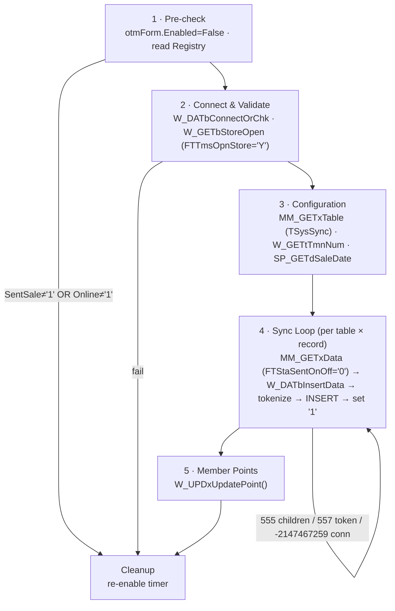

# ServiceTransfer: Program Specification

> 🔗 **Interactive diagrams:** step through the live [Data Sync Flow](../doc-claude-ver/Diagrams/03_Sync_Flow.html) and [Member Points Flow](../doc-claude-ver/Diagrams/05_Member_Points_Flow.html) (full [index](../doc-claude-ver/Diagrams/00_Index.html)). The Mermaid flow below renders natively on GitHub / GitLab / VS Code.

เอกสารฉบับนี้ถอดตรรกะการทำงาน (Logic) ของ ServiceTransfer เดิมที่เขียนด้วย VB6 ออกมาเป็นรูปแบบ **Pseudocode** เพื่อให้ทีมพัฒนาเข้าใจ Flow การทำงานและสามารถนำไปสร้างระบบใหม่ (Re-implement) ในภาษาใดก็ได้โดยไม่ต้องไล่ดูโค้ด VB6

## 1. High-Level Call Graph
ระบบมีจุดเริ่มต้นทำงานหลักๆ อยู่ 2 ส่วนคือ ตอนเปิดโปรแกรม (Form_Load) และลูปประมวลผลหลัก (otmForm_Timer)

```text
Form_Load()                                  [wMain.frm]
├── MM_RECbAdaIniRead()                      อ่าน Config รหัสผ่านฐานข้อมูล
├── W_DATbConnect() x 2                      เชื่อมต่อ Online + Offline DB
├── W_CRTxLogTran()                          สร้าง Log File ประจำวัน
├── SP_GETxVariableAlw() / SP_SETxObjects()  อ่าน Token Config + เตรียม SOAP Client
└── otmForm.Enabled = True                   เริ่ม Timer Loop
 
otmForm_Timer()  <ทุก 500 ms>                [wMain.frm]
├── W_DATbConnectOrChk() + W_GETbStoreOpen() ตรวจสอบ Connection และสถานะเปิดร้าน
├── MM_GETxTable() + SP_GETdSaleDate()       อ่านรายการตารางที่ต้องซิงค์จาก TSysSync
├── LOOP วนทีละตาราง: MM_GETxData()
│   └── LOOP วนทีละเรคอร์ด (Flag='0'):
│       ├── W_DATbInsertData() ── SP_PRCbToken() ── SP_CHKbWebservice()
│       │                      └─ W_PRCbCheckInsertHD()
│       ├── W_DATbUpdateData()        (เมื่อเกิด Duplicate Key)
│       └── W_DATxUpdateByScript()    (อัปเดต Flag กลับเป็น '1' ที่ Local)
└── W_UPDxUpdatePoint() ── SP_PRCbToken()    (ส่งคะแนนเข้า Member DB)
```

---

## 2. Main Processing Loops (Pseudocode)

ภาพรวมรอบการซิงค์ `otmForm_Timer()` (ทำงานทุก 500ms) — 6 เฟส:



### 2.1 Form_Load (เริ่มต้นระบบ)
```vb
FUNCTION Form_Load()
    // 1. ซ่อนหน้าจอเพื่อให้รันเป็น Background Service
    Hide_Application_Window()
    IF App.PrevInstance THEN End // ป้องกันการรันโปรแกรมซ้ำซ้อน

    // 2. อ่านค่า Configuration (AdaIni.Ada)
    IF MM_RECbAdaIniRead() == TRUE THEN
        Save_Registry(SentStaOn, "1")
    ELSE
        Save_Registry(SentStaOn, "0")
        End_Application() // จบการทำงานหากอ่าน Config ไม่ได้
    END IF

    // 3. เชื่อมต่อฐานข้อมูล (Online และ Offline)
    W_DATbConnect(ocnOnline, OnlineServer, OnlineUser, OnlinePassword, OnlineDB)
    W_DATbConnect(ocnOffline, OfflineServer, OfflineUser, OfflinePassword, OfflineDB)
    
    // 4. จัดเตรียมระบบภายนอก
    W_CRTxLogTran() // สร้างไฟล์ Log (TransferOffline_YYYYMMDD.Log)
    SP_GETxVariableAlw() // อ่าน Token Config
    SP_SETxObjects() // เตรียม SafeNet SOAP Client
    
    // 5. เปิดระบบซิงโครไนซ์
    otmForm.Enabled = True // เริ่ม Timer Loop
END FUNCTION
```

### 2.2 otmForm_Timer (รอบการซิงค์ทุก 500 ms)
```vb
FUNCTION otmForm_Timer()
    otmForm.Enabled = False // ป้องกัน Re-entrant

    IF Registry(SentSale) != "1" OR Registry(Online) != "1" THEN
        GOTO Cleanup
    END IF

    // Phase 1: ตรวจสอบสถานะก่อนซิงค์
    IF NOT W_DATbConnectOrChk(ocnOnline) THEN GOTO Cleanup
    IF NOT W_GETbStoreOpen() THEN GOTO Cleanup // ร้านปิด ไม่ต้องซิงค์
    IF NOT W_DATbConnectOrChk(ocnOffline) THEN GOTO Cleanup

    // Phase 2: อ่านตารางเป้าหมาย
    tables = MM_GETxTable() // ดึงจาก TSysSync WHERE FTSscStaActive = '1'
    dSaleDate = SP_GETdSaleDate()

    // Phase 3: วนลูปส่งข้อมูล
    FOR EACH table IN tables:
        // กรองเฉพาะ Transaction ที่ <= วันที่ปัจจุบัน
        records = MM_GETxData(table, "FTStaSentOnOff = '0' AND FDShdTransDate <= dSaleDate")
        
        FOR EACH row IN records:
            bOK = False
            errorNo = 0
            
            // พยายาม INSERT ไปยัง Central DB
            IF W_DATbInsertData(row, table, out errorNo) THEN
                bOK = True
            ELSEIF errorNo == -2147467259 THEN
                GOTO Cleanup // Connection Lost
            ELSEIF errorNo == -2147217873 THEN
                // Duplicate Key (มีอยู่แล้ว) -> เปลี่ยนเป็น UPDATE แทน
                bOK = W_DATbUpdateData(row, table)
            END IF

            // Phase 4: อัปเดต Local DB กลับเมื่อสำเร็จ
            IF bOK THEN
                W_DATxUpdateByScript(row, table) // UPDATE Local SET FTStaSentOnOff = '1'
            END IF
        NEXT
    NEXT

    // Phase 5: ประมวลผลคะแนนสะสม
    W_UPDxUpdatePoint()

Cleanup:
    otmForm.Enabled = True // เปิด Timer รอทำงานรอบถัดไป
END FUNCTION
```

---

## 3. Data Sync & Insertion Logic

### 3.1 W_DATbInsertData (การต่อ SQL Insert)
นี่คือฟังก์ชันที่เป็นจุดเสี่ยงที่สุด (Vulnerable) เนื่องจากใช้วิธีต่อ String สร้าง SQL

```vb
FUNCTION W_DATbInsertData(record, tableName, OUT errorNo)
    // 1. HD-First Rule (ตรวจสอบว่าตารางลูกต้องส่งครบแล้ว)
    IF tableName == "TPSTSalHD" THEN
        FOR childTable IN [TPSTSalDT, TPSTSalRC, TPSTSalCD, TPSTSalePoint]:
            IF EXISTS(childTable WHERE keys_match AND FTStaSentOnOff != '1') THEN
                errorNo = 555 // ลูกยังไม่ครบ ห้ามส่ง HD
                RETURN False
            END IF
        NEXT
    END IF

    // 2. ลบข้อมูลเก่าหากมีตกค้าง (Delete Before Insert)
    IF EXISTS(ServerRecord WHERE keys_match AND FTShdStaDoc != '1') THEN
        DELETE FROM tableName WHERE keys_match
    END IF

    // 3. สร้าง SQL INSERT อัตโนมัติ (Dynamic SQL Generation)
    sqlFields = ""
    sqlValues = ""
    
    FOR EACH field IN record.Fields:
        prefix = Substring(field.Name, 2, 1) // ดูตัวอักษรตัวที่ 2 เช่น F(T)
        value = field.Value
        
        SWITCH prefix:
            CASE "T": // Text
                IF IsTokenTarget(tableName, field.Name, record.TransType) THEN
                    IF SP_PRCbToken(value, OUT tokenValue) THEN
                        value = tokenValue
                    ELSE
                        errorNo = 557 // Token Failed
                        RETURN False
                    END IF
                END IF
                value = "'" + EscapeSingleQuotes(value) + "'"
            CASE "C", "N": // Numeric
                IF value IS NULL THEN value = 0
            CASE "D": // Date
                IF value IS NULL THEN value = "NULL" ELSE value = FormatDate(value)
        END SWITCH
        
        sqlFields += field.Name + ","
        sqlValues += value + ","
    NEXT

    // 4. Execute Statement
    EXECUTE("INSERT INTO " + tableName + "(" + sqlFields + ") VALUES (" + sqlValues + ")")
    
    // 5. Post Check สำหรับ HD
    IF tableName == "TPSTSalHD" THEN
        IF NOT EXISTS(ServerRecord) THEN
            ResetAllChildTablesToZero(keys) // สั่งซิงค์ใหม่หมด (Error 556)
            RETURN False
        END IF
    END IF
    
    RETURN True
END FUNCTION
```

---

## 4. Member Point Logic

### 4.1 W_UPDxUpdatePoint (คำนวณและส่งคะแนน)
```vb
FUNCTION W_UPDxUpdatePoint()
    // 1. ดึงข้อมูลคะแนนที่ยังไม่ได้ส่ง (FTRemark = '0')
    records = SELECT SUM(FCSpoPoint), FTSpoMemID 
              FROM TPSTSalePoint 
              WHERE FTRemark = '0' AND FTSpoMemID != ''
              GROUP BY FTSpoMemID

    FOR EACH row IN records:
        // 2. สร้าง Token สำหรับ Member ID
        SP_PRCbToken(row.FTSpoMemID, OUT tokenMemberId)
        
        // 3. กำหนดเครื่องหมายคะแนน (บางประเภทบิลคือลบคะแนน)
        points = row.FCSpoPoint
        IF TransType IN (Return, Void, CancelDeposit, CancelVoucher) THEN
            points = points * -1
        END IF

        // 4. อัปเดต Member DB
        member = SELECT FROM TCNMMallCard WHERE FTMcdCode = tokenMemberId
        IF member EXISTS THEN
            UPDATE TCNMMallCard 
            SET FCEarned = FCEarned + points, 
                FCBalance = FCBalance + points
        ELSE
            INSERT INTO TCNMMallCard (FTMcdCode, FTMcdStaAct, FCEarned, FCBalance)
            VALUES (tokenMemberId, 'A', points, points)
        END IF

        // 5. เก็บประวัติ (History) และเปลี่ยนสถานะ (Remark)
        INSERT INTO TPSTBPHis (MemberID, PointChanges, Balance)
        
        UPDATE TPSTSalePoint 
        SET FTRemark = '1' // ทำเครื่องหมายว่าประมวลผลแล้ว
        WHERE FTSpoMemID = row.FTSpoMemID
    NEXT
END FUNCTION
```
