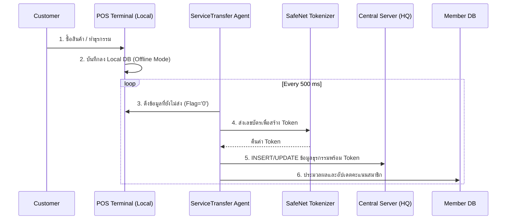
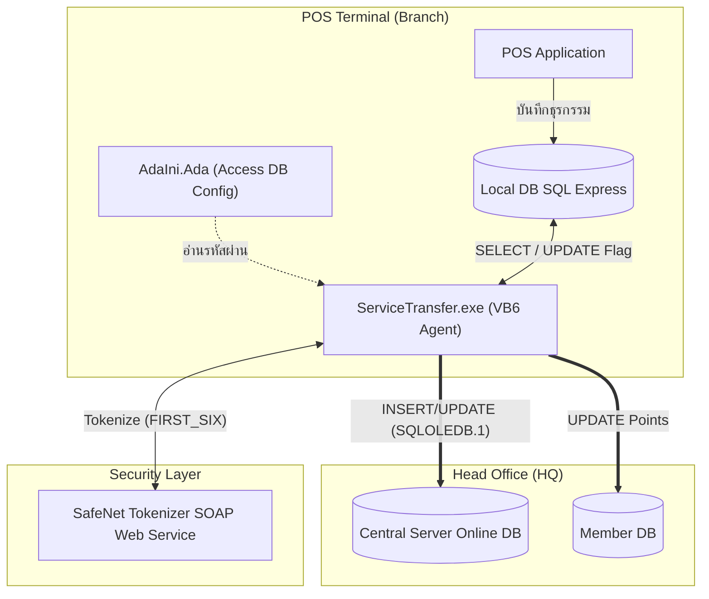
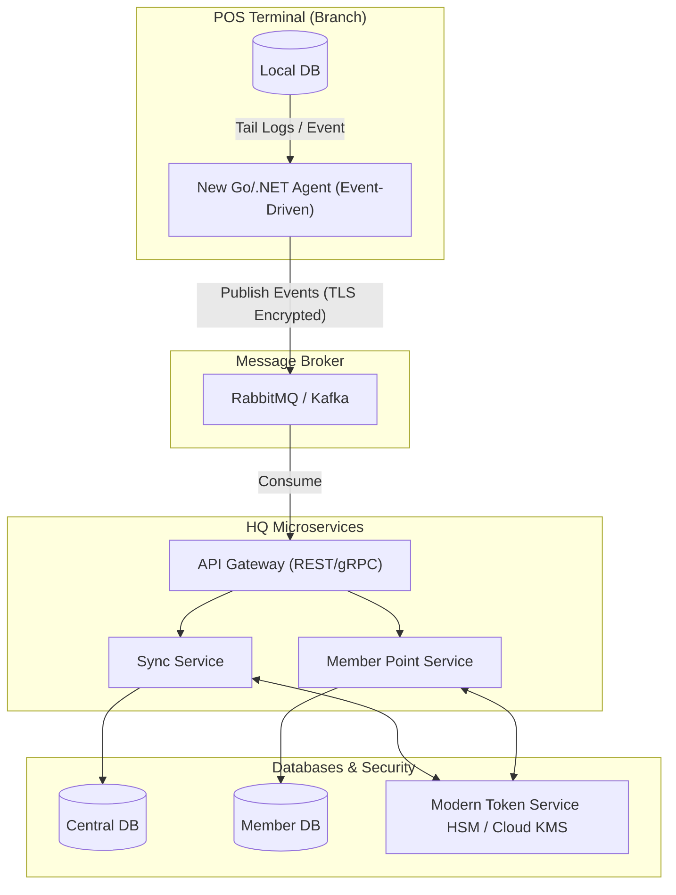

# ServiceTransfer: Software Requirements Specification & Architecture

## 1. Executive Summary
**ServiceTransfer** is a background data-synchronization agent originally written in Visual Basic 6.0. It runs on every POS terminal at branch stores, operating via a 500ms timer loop. Its primary duties are:
1. **Sales Synchronization:** Transfers pending sales transactions (header, detail, receipt, card, deposit, hold, voucher, and points) flagged with `FTStaSentOnOff = '0'` from the local SQL Server Express database to the central SQL Server at the Head Office.
2. **Data Tokenization:** Tokenizes sensitive card data through the SafeNet SOAP web service before any sensitive value leaves the branch.
3. **Member Points:** Posts accumulated member points to a separate Member database (`TCNMMallCard` / `TPSTBPHis`).

While resilient (handling duplicate updates, timeouts, and ensuring header records are only sent after child tables), it carries significant legacy risks: VB6 is EOL, SQL statements are dynamically concatenated (SQL Injection risk), lack of DB transactions, plain-text credentials, and inefficient 500ms polling. This document outlines the legacy behavior and the targeted revamp architecture.

---

## 2. Business Context & Stakeholders

### 2.1 Stakeholders
| ผู้มีส่วนได้ส่วนเสีย (Stakeholder) | ความคาดหวัง (Expectation) |
| --- | --- |
| **Branch Operations (สาขา)** | POS ทำงาน offline ได้ และ auto-sync ข้อมูลทันทีเมื่อเชื่อมต่อกลับ |
| **HQ Management (สำนักงานใหญ่)** | ข้อมูลยอดขายรวมศูนย์แบบใกล้เคียง Real-time สำหรับ Reporting & Analytics |
| **Members / Customers (สมาชิก)** | คะแนนสะสมได้รับการอัปเดตและพร้อมใช้งานได้โดยเร็ว |
| **Compliance (PCI-DSS)** | ข้อมูลบัตรเครดิต/สมาชิกต้องถูก Tokenize เสมอก่อนส่งออกจากสาขา |
| **IT Operations** | Auto-recovery เมื่อเกิดข้อผิดพลาด, Logging ชัดเจน, ลด manual intervention |

### 2.2 End-to-End Business Flow

---

## 3. System Architecture (Legacy)

### 3.1 Legacy Component Architecture
สถาปัตยกรรมเดิมใช้การรันโปรแกรม Background บนเครื่อง POS โดยเชื่อมต่อฐานข้อมูลโดยตรงผ่าน ADODB OLEDB Provider ຂ้ามระบบเครือข่าย

### 3.2 Key Features & Constraints
- **Automated Background Sync:** ทำงานด้วย Timer Polling ทุก 500 ms ซึ่งกินทรัพยากร CPU/IO สูงเกินความจำเป็น
- **Resilient Offline Support:** ระบบรองรับ Offline Mode เต็มรูปแบบโดยอาศัย Flag `FTStaSentOnOff` 
- **Dynamic SQL Generation:** โค้ดใช้วิธีการต่อ String (Concatenation) เพื่อสร้าง SQL Query ซึ่งเป็นจุดอ่อนด้าน Security
- **Multi-Table Sync:** ซิงค์ตารางเรียงลำดับตามคอนฟิก `TSysSync` โดยยึดหลัก HD-First Rule (ตรวจสอบว่าตารางลูกต้องส่งครบก่อนส่ง Header)
- **Tokenization:** ห้ามส่งเลขบัตรจริงออกจากสาขาโดยเด็ดขาด

---

## 4. Revamp Recommendations (Target Architecture)

การปรับปรุงระบบ (Revamp) ไม่ควรเป็นการแปลงโค้ดจาก VB6 เป็นภาษาใหม่โดยตรง แต่ควรปรับแก้ปัญหาในเชิงสถาปัตยกรรม (Architectural Shift) ให้เป็นระบบที่มีความปลอดภัย ลดภาระระบบ และขยายขนาด (Scale) ได้ง่ายขึ้น

### 4.1 Recommended Target Architecture
แทนที่การเปิด Connection ฐานข้อมูลข้าม WAN ด้วยการใช้สถาปัตยกรรมแบบ **Event-Driven** และ **API Gateway**

### 4.2 Prioritized Improvement List
1. **CRITICAL - Event-Driven Architecture:** เปลี่ยนจาก Timer Polling (500ms) เป็นการดักจับ Event เมื่อมีบิลใหม่ (เช่น File System Watcher หรือ CDC จาก Local DB) ส่งเข้า Message Queue
2. **CRITICAL - API Gateway & Transactions:** ห้ามต่อ DB ข้ามเครือข่าย ให้ยิงข้อมูลเข้า API ที่ฝั่ง HQ แทน เพื่อให้ API เป็นคนควบคุม Database Transaction (BEGIN TRAN...COMMIT) ป้องกันข้อมูลขาดหาย
3. **CRITICAL - Parameterized Queries:** เลิกวิธีการต่อ String (Concatenation) เพื่อสร้าง SQL และใช้ ORM หรือ Parameterized SQL อย่างเคร่งครัด
4. **HIGH - Connection Encryption & Secrets:** บังคับใช้ TLS/SSL ระหว่างสาขาและสำนักงานใหญ่ และย้าย Credentials ไปไว้ใน Secure Vault (แทน MS Access DB)
5. **MEDIUM - Observability:** เพิ่ม Structured Logging (เช่น JSON Logs) และ Health Check ให้ตรวจสอบสถานะ Agent ของทุกสาขาจากศูนย์กลางได้
